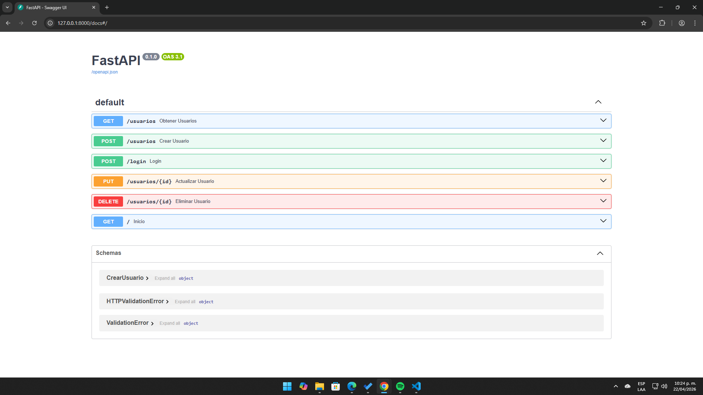

VitaCitas Backend API

API REST para la gestión de citas médicas, desarrollada con FastAPI y PostgreSQL. Incluye autenticación basada en JWT y estructura modular orientada a escalabilidad. Con este proyecto busco seguir fortaleciendo mi aprendizaje en el mundo del desarrollo y consolidarme como un desarrollador de software, especializado en el backend.


Caracteristicas actuales del proyecto:
* Permite el registro de usuarios, también la validación de lo que se ha guardado en la base de datos por medio de los Endpoint de usuarios.
* Simulación de un inicio de sesión con los usuarios creados previamente por medio del Endpoint login.
* Encriptación de contraseñas por medio de token y autenticación basada en JWT.
* CRUD de recursos y protección de rutas (aun en desarrollo).

Aquí hay una vista de la API



Tecnologías Utilizadas:
- Lenguaje: Python.
- Framework: FastAPI.
- Base de datos: PostgreSQL.
- Hashing de contraseñas: Libreria Passlib.
- JWT: Python-Jose.


¿Cómo funciona el sistema de autenticación?
El sistema utiliza JSON Web Tokens (JWT):

1. El usuario inicia sesión en `/login`
2. Se genera un token de acceso
3. El cliente debe enviar el token en cada petición:

Authorization: Bearer <token>


¿Cómo instalar y ejecutar el proyecto?

- Primero clona el repositorio:
```bash
git clone https://github.com/arteagagarcia7/vitacitas-backend.git
cd vitacitas-backend
```

- Crea un entorno virtual:
python -m venv venv 
source venv/bin/activate (Si usas Linux o Mac)
venv\Scripts\activate (Si usas Windows)

- Instala las dependencias:
pip install -r requirements.txt

- Configura las variables de entorno:
Crear archivo .env con lo siguiente:
SECRET_KEY=tu_clave_secreta
DATABASE_URL=tu_conexion_postgresql

- Ejecuta el servidor:
uvicorn main:app --reload

- Ingresa a la documentación interactiva:
http://127.0.0.1:8000/docs


¿Cuál es el estado actual del proyecto?
En desarrollo. Actualmente cuenta con autenticación funcional y base sólida para expansión a un sistema completo de gestión de citas médicas.
Proximamente se desarrollará los roles de usuario, el refresh de tokens, creación e integración del frontend usando vue.js, y despliegue en la nube.

Autor:
Carlos Andrés Arteaga
Desarrollador backend en formación, enfocado en aplicaciones web y buenas prácticas de desarrollo.